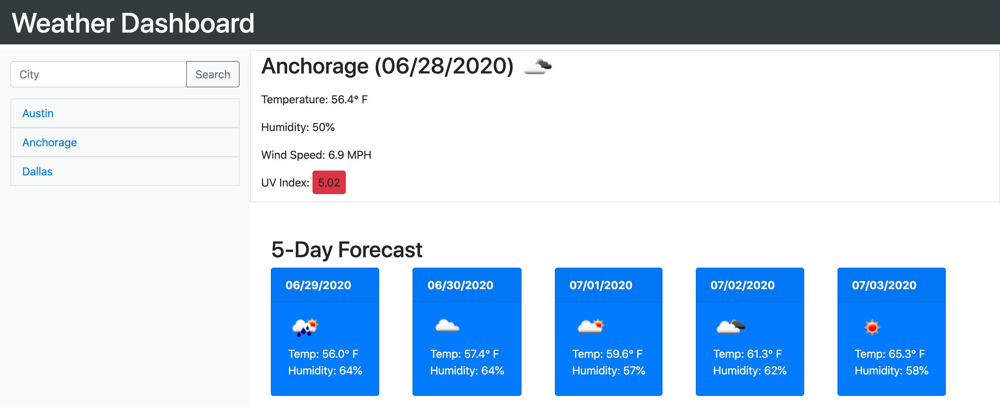

# Weather Dashboard

## Purpose
A website that was created to allow user to search weather conditions by city. When user inputs a city name and hits the search button, the page will load with the forecast for the current date and the upcoming five day forecast. 

Utilizing the 3rd party API, Open Weather, the daily forecast shows the temperature, humidity, wind speed and UV Index for the day. Using the same source, it loads the temperature and humidity for the next five days. 

Each city searched will be saved to the page, so if the user would like to quickly search for the same city, they may click on the previously searched city name and it will reload the page with the corresponding information. These previously searched cities will also be saved to localStorage and displayed again on page reload. Application utilizes momentjs to show current datea and upcoming dates for the five day forecast. 

## Built With
* HTML
* CSS
* Javascript
* Bootstrap
* Moment.js
* 3rd Party API Used - https://openweathermap.org/api

## Screenshot of Application

## Deployed Website
https://melissabcadena.github.io/weather-dashboard/

## GitHub Link
https://github.com/melissabcadena/weather-dashboard.git